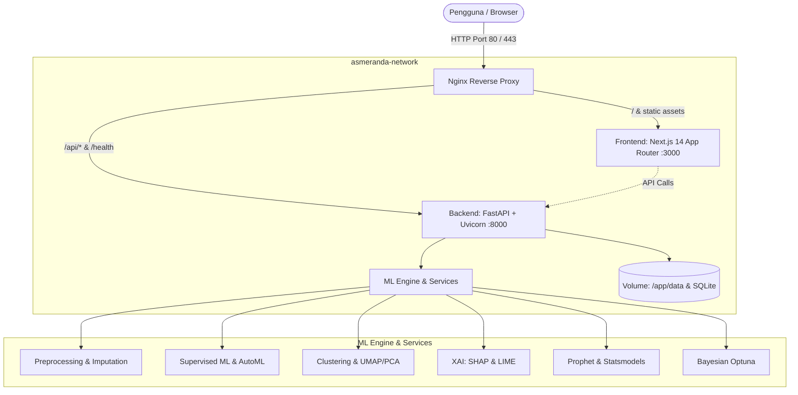

# Asmeranda AI

Platform machine learning modular berbasis enterprise untuk workflow data science *end-to-end*. Mulai dari upload dataset, eksplorasi data (EDA), preprocessing adaptif, pelatihan model, optimasi hyperparameter, interpretasi model (XAI), hingga deteksi anomali dan forecasting deret waktu — semua dalam satu platform terintegrasi dengan keamanan berbasis peran (RBAC).

---

## 🏗️ Arsitektur Sistem & Topologi Docker



---

## 🚀 Fitur Utama

### 🔐 Keamanan & Kontrol Akses
- **RBAC (Role-Based Access Control)**: Tiga tingkat akses — `Admin`, `Analyst`, dan `Viewer`.
- **JWT & API Key**: Token sesi terenkripsi AES-256/GCM dan kunci API layanan.
- **Validasi Password**: Aturan kompleksitas ketat (huruf besar, kecil, angka, simbol, panjang minimum).
- **Security Middleware**: Header keamanan HTTP (CSP, HSTS, X-Frame-Options), proteksi DoS, dan rate limiting adaptif via SlowAPI.
- **Audit Log**: Jejak aktivitas terstruktur di `security_audit.log`.

### 🧠 Machine Learning Supervised
- **9+ Algoritma**: RandomForest, XGBoost, LightGBM, CatBoost, GradientBoosting, SVM, DecisionTree, KNN, Regresi Logistik/Linear.
- **Validasi Silang**: K-Fold, Stratified K-Fold, Leave-One-Out, Time Series Split.
- **Optimasi Hiperparameter**: Grid Search, Random Search, dan Bayesian Optimization via Optuna.
- **Rekomendasi Otomatis**: Saran algoritma dan pipeline preprocessing berdasarkan karakteristik dataset.
- **Evaluasi Lengkap**: ROC-AUC, PR Curve, Confusion Matrix, MCC, MAPE, Balanced Accuracy, Learning Curve.

### 🔍 Machine Learning Unsupervised & Reduksi Dimensi
- **Clustering**: KMeans, DBSCAN, Hierarchical, Spectral, dan HDBSCAN.
- **Optimal-K**: Analisis otomatis via Elbow Method dan Silhouette Score.
- **Reduksi Dimensi**: UMAP dan PCA untuk visualisasi data berdimensi tinggi (2D/3D).

### 💡 Explainable AI (XAI)
- **SHAP**: Feature importance global menggunakan TreeExplainer, LinearExplainer, dan KernelExplainer.
- **LIME**: Penjelasan prediksi lokal per instance untuk data tabular.

### 📈 Time Series & Deteksi Anomali
- **Forecasting**: ARIMA, SARIMA, Prophet, LSTM, dan rata-rata bergerak dengan inferensi frekuensi otomatis.
- **Deteksi Anomali**: Isolation Forest, One-Class SVM, dan batas statistik rolling.

### 🧹 Pemrosesan Data & EDA
- **Inferensi Tipe Otomatis**: Deteksi kolom numerik, kategorik, datetime, dan teks.
- **Pipeline Preprocessing**: Imputasi nilai hilang, deteksi outlier, encoding kategorik, dan scaling fitur.
- **EDA Suite**: Statistik deskriptif, histogram distribusi, dan heatmap korelasi.

---

## 🛠️ Teknologi yang Digunakan

| Lapisan | Teknologi |
|---|---|
| **Backend API** | FastAPI, Pydantic v2, Uvicorn, Starlette, SlowAPI |
| **Engine Data** | Polars, Pandas, PyArrow, NumPy |
| **Machine Learning** | scikit-learn, XGBoost, LightGBM, CatBoost, Optuna, statsmodels |
| **Explainable AI** | SHAP, LIME |
| **Visualisasi** | Matplotlib, Seaborn |
| **Keamanan & Auth** | PyJWT, Bcrypt, Cryptography, Passlib |
| **Frontend** | Next.js 14 (App Router), React 18, Zustand, Custom CSS |
| **Infra & Container** | Docker, Docker Compose, Nginx (Alpine), Multi-stage build |
| **Cloud Target** | Azure Container Apps, AWS, GCP |

---

## 📦 Panduan Instalasi & Menjalankan

### Prasyarat Sistem
- **Python 3.11+**
- **Node.js 18+** dan `npm`
- **Docker Desktop** (dengan backend WSL2 aktif di Windows)

---

### Opsi 1: Menjalankan dengan Docker Compose (Direkomendasikan)

Semua service (Backend, Frontend, dan Nginx Reverse Proxy) telah dikonfigurasi secara optimal dan terintegrasi dengan healthcheck otomatis.

#### 1. Jalankan Seluruh Stack
```bash
# Build dan jalankan semua container di latar belakang
docker compose up --build -d
```

#### 2. Periksa Status Kontainer
```bash
# Pastikan container backend berstatus "healthy" dan semua container "Up"
docker compose ps
```

#### 3. Akses Layanan Melalui Docker
- **Aplikasi Web (via Nginx)**: [http://localhost](http://localhost) (Port 80)
- **Aplikasi Web Langsung (Frontend)**: [http://localhost:3000](http://localhost:3000)
- **API Backend Langsung**: [http://localhost:8000](http://localhost:8000)
- **Dokumentasi Swagger API**: [http://localhost:8000/docs](http://localhost:8000/docs)
- **Health Check Endpoint**: [http://localhost:8000/health](http://localhost:8000/health)

#### 4. Perintah Operasional Docker
```bash
# Melihat log real-time
docker compose logs -f

# Melihat log backend saja
docker compose logs -f backend

# Melihat log frontend saja
docker compose logs -f frontend

# Update/rebuild satu service tertentu
docker compose up --build -d backend
docker compose up --build -d frontend

# Menghentikan seluruh container
docker compose down
```

---

### Opsi 2: Menjalankan Secara Lokal (Development)

#### 1. Setup Backend FastAPI

```bash
# Masuk ke root direktori
cd asmeranda-modular

# Buat virtual environment
python -m venv .venv

# Aktivasi virtual environment
# Windows (PowerShell):
.\.venv\Scripts\Activate.ps1
# Windows (CMD):
# .\.venv\Scripts\activate.bat
# Linux/macOS:
# source .venv/bin/activate

# Install dependensi backend
pip install -r backend/requirements-backend.txt

# Buat file konfigurasi .env dari contoh
cp .env.example .env

# Jalankan server FastAPI dengan auto-reload
python -m uvicorn backend.main:app --host 0.0.0.0 --port 8000 --reload
```

#### 2. Setup Frontend Next.js

```bash
# Buka terminal baru, masuk ke direktori frontend
cd frontend

# Install paket Node.js
npm install

# Jalankan development server Next.js
npm run dev
```

---

## 🔑 Kredensial Default

| Akun | Username | Password Default | Role |
|---|---|---|---|
| **Administrator** | `admin` | `Admin@Asmeranda2026!` | `admin` |

> [!TIP]
> Demi keamanan, segera ganti password administrator melalui antarmuka pengguna atau file konfigurasi saat melakukan deployment produksi.

---

## 📊 Referensi Endpoint API Utama

| Endpoint | Metode | Deskripsi |
|---|---|---|
| `/health` | `GET` | Cek status kesehatan sistem & versi runtime |
| `/docs` | `GET` | Dokumentasi interaktif Swagger UI |
| `/api/v1/auth/login` | `POST` | Login autentikasi & penerbitan token JWT |
| `/api/v1/auth/register` | `POST` | Registrasi pengguna baru |
| `/api/v1/auth/me` | `GET` | Informasi profil pengguna aktif |
| `/api/v1/datasets/upload` | `POST` | Upload dataset (CSV, XLSX, Parquet, JSON) |
| `/api/v1/datasets/list` | `GET` | Daftar semua dataset yang tersimpan |
| `/api/v1/datasets/{id}/preview` | `GET` | Preview data tabular dengan paginasi |
| `/api/v1/eda/summary` | `POST` | Statistik deskriptif & analisis missing values |
| `/api/v1/preprocessing/run` | `POST` | Eksekusi pipeline preprocessing & train-test split |
| `/api/v1/preprocessing/cluster` | `POST` | Analisis clustering unsupervised |
| `/api/v1/training/start` | `POST` | Memulai training model ML secara asinkron |
| `/api/v1/training/models` | `GET` | Daftar model yang telah selesai dilatih beserta metriknya |
| `/api/v1/optimization/hyperparameters` | `POST` | Hyperparameter tuning dengan Optuna Bayesian search |
| `/api/v1/interpretation/shap` | `POST` | Kalkulasi global & local feature importance (SHAP) |
| `/api/v1/interpretation/lime` | `POST` | Penjelasan lokal prediksi per data (LIME) |
| `/api/v1/timeseries/forecast` | `POST` | Pelatihan model forecasting deret waktu |
| `/api/v1/advanced-ml/umap` | `POST` | Reduksi dimensi data kompleks via UMAP |

---

## 🧪 Testing & Verifikasi Kualitas

```bash
# Menjalankan unit tests
pytest backend/tests/unit/ -v

# Menjalankan test modul keamanan (RBAC, Auth, Rate Limiter)
pytest backend/tests/security/ -v

# Menjalankan pengujian integrasi
pytest backend/tests/integration/ -v

# Verifikasi deployment lokal & dependensi end-to-end
python final_verification.py
```

---

## 📁 Struktur Direktori

```text
asmeranda-modular/
├── backend/                  # Source code Backend (FastAPI)
│   ├── api/v1/               # Endpoint REST API v1
│   ├── core/                 # Auth, Security, Config, State Management
│   ├── models/               # Domain & database models
│   ├── schemas/              # Pydantic schemas (request/response)
│   ├── services/             # Core ML, EDA, XAI, Preprocessing services
│   ├── tests/                # Test suite (unit, integration, security)
│   ├── Dockerfile            # Container definition untuk backend
│   ├── main.py               # FastAPI entrypoint
│   └── requirements-backend.txt # Runtime dependencies
├── frontend/                 # Source code Frontend (Next.js 14 App Router)
│   ├── src/app/              # Next.js pages & routes
│   ├── src/components/       # UI Components
│   ├── Dockerfile            # Container definition untuk frontend
│   └── package.json          # Node dependencies & scripts
├── nginx/                    # Konfigurasi reverse proxy Nginx
│   └── nginx.conf            # Nginx routing configuration
├── data/                     # Volume penyimpanan dataset lokal
├── docker-compose.yml        # Multi-container orchestration
├── .env.example              # Template konfigurasi environment
├── final_verification.py     # Script verifikasi deployment end-to-end
└── README.md                 # Dokumentasi proyek
```

---

## ☁️ Deployment ke Cloud

| Platform | Script / File Deployment |
|---|---|
| **Azure Container Apps** | `deploy-to-azure.bat` (Windows) / `./deploy-to-azure.sh` (Linux) |
| **AWS ECS / EKS** | `./deploy-cloud-aws.sh` |
| **Google Cloud Run / GKE**| `./deploy-cloud-gcp.sh` |
| **Docker Desktop** | `./deploy-docker-desktop.ps1` |

---

## 📝 Lisensi & Kontak

Perangkat lunak proprietary milik **PT. Asmer Sahabat Sukses**.

- **Email Support**: support@asmeranda.ai
- **Dokumentasi Interaktif**: Akses `/docs` setelah server berjalan

---

**Asmeranda AI — Platform Machine Learning Modular End-to-End**  
© 2024–2026 PT. Asmer Sahabat Sukses. Seluruh hak dilindungi undang-undang.